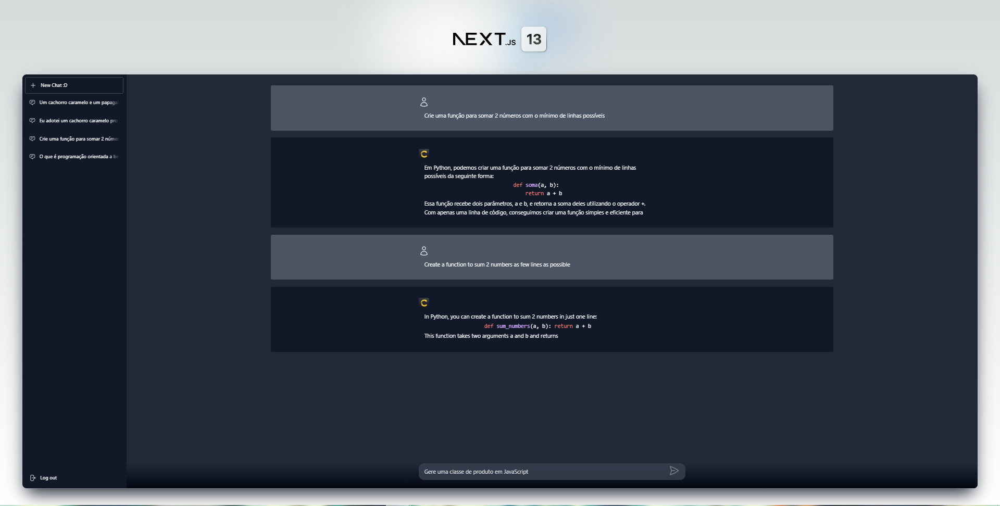

# NextGPT
<p align="center"> 
  <a href="https://fullcycle.com.br/" target="_blank">
    
  </a> 
</p>

<h4 align="center" >🚀 🟨 Full Cycle Learning Experience - 2023 🟨 🚀</h4>

<h4 align="center">
  Application developed during a Programmer Event, the <a style="color: #8a4af3;" href="https://github.com/search?q=full%20cycle%20learning%20experience&type=repositories" target="_blank">Full Cycle Learning Experience</a> promoted by <a style="color: #8a4af3;" href="https://fullcycle.com.br/" target="_blank">@FullCycleSchool</a>
</h4>

#

<p align="center">
  |&nbsp;&nbsp;
  <a style="color: #8a4af3;" href="#project">Overview</a>&nbsp;&nbsp;&nbsp;|&nbsp;&nbsp;&nbsp;
  <a style="color: #8a4af3;" href="#techs">Technologies</a>&nbsp;&nbsp;&nbsp;|&nbsp;&nbsp;&nbsp;
  <a style="color: #8a4af3;" href="#app">Project</a>&nbsp;&nbsp;&nbsp;|&nbsp;&nbsp;
  <a style="color: #8a4af3;" href="#run-project">Run</a>&nbsp;&nbsp;&nbsp;|&nbsp;&nbsp;
  <a style="color: #8a4af3;" href="#author">Author</a>&nbsp;&nbsp;&nbsp;|&nbsp;&nbsp;&nbsp;
</p>

#

<h1 align="center">
  
  <a href="https://github.com/Samuel-Ricardo">
    
  </a>

  <a herf="https://www.instagram.com/samuel_ricardo.ex/">
     
  </a>

  <a herf='https://www.linkedin.com/in/samuel-ricardo/'>
     
  </a>

</h1>

<br>

<p id="project"/>

<br>

<h2>  | :artificial_satellite: About:  </h2>

<p align="justify">
    This project is one application of a complete Full Cycle Chat project to talk in real time with Chat-GPT, with amazing technologies like NextJS for front-end, Back-End for Front-end with NextJS, Next Auth + Keyclock for Authentication and Users management, MySQL database, GO Lang for microsservice, Docker and the power of Chat-GPT with real time reactive data and gRPC communication.
</p>

<p align="center">
  
  
  
  
  
  
   
   
</p>

<br>
<br>

<p align="justify">
    This application is a chat site to talk directly with a AI powered by the amazing OpenAI Chat GPT, creating chats with isolated context and real time messages and stream responses, using a advanced authentication system all this with a clean and modern Metalic UI.
</p>

> <a href="https://github.com/Samuel-Ricardo" target="_blank">  </a>

  <br>

#

<br/>

- Front-End & Back-End : NextJS | [ [repositories](https://github.com/Samuel-Ricardo/NextGPT) ]
- microsservice : GO Lang | [ [repositories](https://github.com/Samuel-Ricardo/GPT-Chat_Service) ]

#

<br>


<h2 id="run-project"> 
   👨‍💻 | How to use
</h2>

<br>

### Open your Git Terminal and clone this repository

```git
  $ git clone "git@github.com:Samuel-Ricardo/NextGPT.git"
```

### Make Pull

```git
  $ git pull "git@github.com:Samuel-Ricardo/NextGPT.git"
```

<br>

This application use `Docker` so you dont need to install and cofigurate anything other than docker on your machine.

> <a target="_blank" href="https://www.docker.com/">  </a>

<br>

Once Docker is setup, we can start the project :D

</p>

```bash

  # After setup docker environment just run this commmand on root project folder:

  $ docker-compose up --build   # For First Time run this command

  $ docker-compose up           # to run project


```

```bash

  #Apps Running on:

  $ Site: http://localhost:3000

  See more: ./next-gpt/docker-compose.yaml

```

<br>

<h2> 
   👨‍💻 | How to run the full project
</h2>

First, you need to setup the GO Lang Microsservice, click on image bellow to setup it

> <a target="_blank" href="https://github.com/Samuel-Ricardo/GPT-Chat_Service#------how-to-use">  </a>

Now, you can setup this NextJS App, click on image bellow to setup it

> <a target="_blank" href="https://github.com/Samuel-Ricardo/NextGPT#run-project">  </a>

#

<br>
<br>

#


