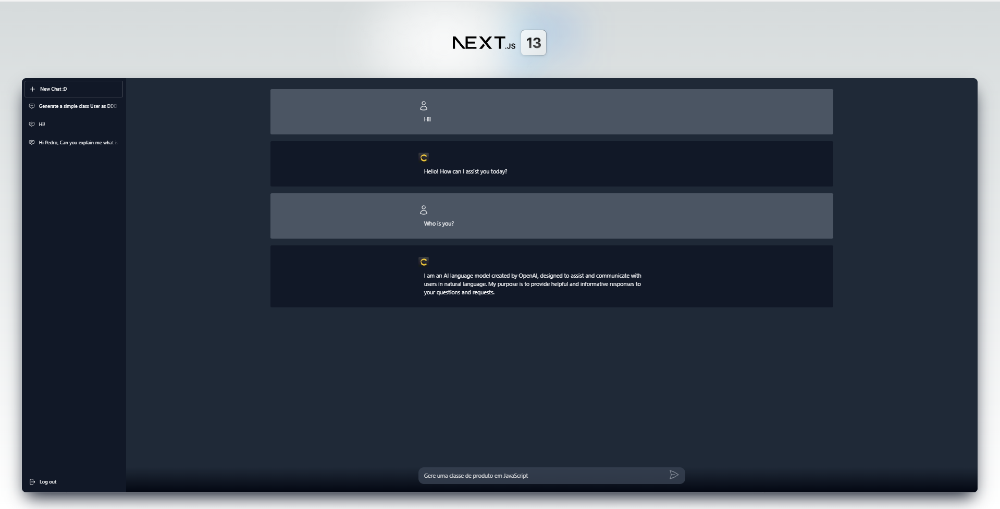
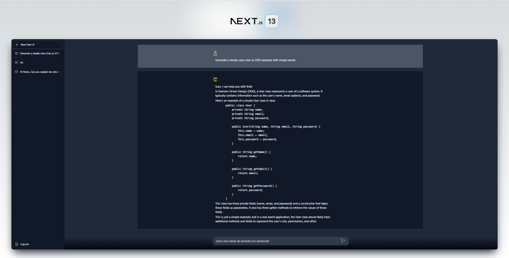
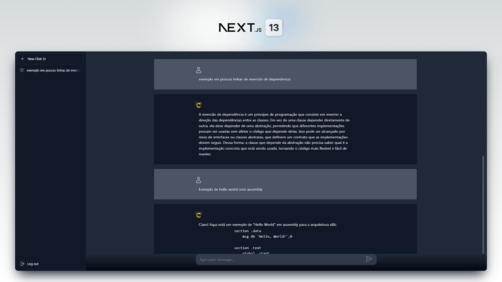
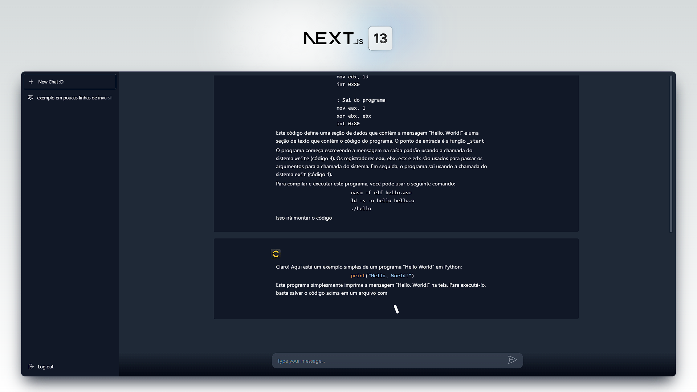

# NextGPT
<p align="center"> 
  <a href="https://fullcycle.com.br/" target="_blank">
    
  </a> 
</p>

<h4 align="center" >🚀 🟨 Full Cycle Learning Experience - 2023 🟨 🚀</h4>

<h4 align="center">
  Application developed during a Programmer Event, the <a style="color: #8a4af3;" href="https://github.com/search?q=full%20cycle%20learning%20experience&type=repositories" target="_blank">Full Cycle Learning Experience</a> promoted by <a style="color: #8a4af3;" href="https://fullcycle.com.br/" target="_blank">@FullCycleSchool</a>
</h4>

#

<p align="center">
  |&nbsp;&nbsp;
  <a style="color: #8a4af3;" href="#project">Overview</a>&nbsp;&nbsp;&nbsp;|&nbsp;&nbsp;&nbsp;
  <a style="color: #8a4af3;" href="#techs">Technologies</a>&nbsp;&nbsp;&nbsp;|&nbsp;&nbsp;&nbsp;
  <a style="color: #8a4af3;" href="#app">Project</a>&nbsp;&nbsp;&nbsp;|&nbsp;&nbsp;
  <a style="color: #8a4af3;" href="#run-project">Run</a>&nbsp;&nbsp;&nbsp;|&nbsp;&nbsp;
  <a style="color: #8a4af3;" href="#author">Author</a>&nbsp;&nbsp;&nbsp;|&nbsp;&nbsp;&nbsp;
</p>

#

<h1 align="center">
  
  <a href="https://github.com/Samuel-Ricardo">
    
  </a>

  <a herf="https://www.instagram.com/samuel_ricardo.ex/">
     
  </a>

  <a herf='https://www.linkedin.com/in/samuel-ricardo/'>
     
  </a>

</h1>

<br>

<p id="project"/>

<br>

<h2>  | :artificial_satellite: About:  </h2>

<p align="justify">
    This project is one application of a complete Full Cycle Chat project to talk in real time with Chat-GPT, with amazing technologies like NextJS for front-end, Back-End for Front-end with NextJS, Next Auth + Keyclock for Authentication and Users management, MySQL database, GO Lang for microsservice, Docker and the power of Chat-GPT with real time reactive data and gRPC communication.
</p>

<p align="center">
  
  
  
  
  
  
   
   
</p>

<br>
<br>

<p align="justify">
    This application is a chat site to talk directly with a AI powered by the amazing OpenAI Chat GPT, creating chats with isolated context and real time messages and stream responses, using a advanced authentication system all this with a clean and modern Metalic UI.
</p>

<p align="justify">
    Here i use a complete test ambiente, Unit test, E2E, back-end, front-end, using jest, cypress... All application have a robust base because of it.
</p>

> <a href="https://github.com/Samuel-Ricardo" target="_blank">  </a>

  <br>

#

<br/>

- Front-End & Back-End : NextJS | [ [repositories](https://github.com/Samuel-Ricardo/NextGPT) ]
- microsservice : GO Lang | [ [repositories](https://github.com/Samuel-Ricardo/GPT-Chat_Service) ]

#

<br>

<h2 id="techs">
  :building_construction: | Technologies and Concepts Studied:
</h2>

> <a href='https://nextjs.org/'>  </a>

- NextJS
- gRPC
- SWR
- Streams
- TailwindCSS
- Prisma
- MySQL
- Typescript
- Jest
- Cypress
- Docker
- Enzyme
- Marked
- Axios
- eslint
- Prettier
- husky
- isomorphic-fetch
- lint-staged
- Highlight.js
- Mullti Thread and Concurrency
- Design Patterns
- Perfomance
- Clean Architeture
- Clean Code / SOLID
- Scalability
- Real Time

> Among Others...

#

<br>


<h2 id="app">
  💻 | Application:
</h2>

> Go to the video demo by clicking on any image
  
  <br>
  <br>

> <a target="_blank" href="https://github.com/Samuel-Ricardo/NextGPT/tree/main/readme_file">  </a>

 First of all, this is a full stack app that une back and front end in the same project, all thanks to NextJS. So the backend part is a REST API with middlewares and routes authentications. This API communicate with GO Lang Microsservice to manage the chat life cycle and handle with GPT, by otherside, the api manage the user life cylce using Next Auth to connect with Keycloack a complete auth system with a dashboard full of functionalities that gives to you the control of system as user friendly way, perfect for no technical people,

> <a target="_blank" href="https://github.com/Samuel-Ricardo/NextGPT/tree/main/readme_file">  </a>

 This whole project is concerned with having a robust base, for that, i apply concepts of clean archteture both in back and in front end for a better programming experience and maintainability, you can see patterns like, repository, gateway, controller, DTO, service (adapted), use case, factory, entity  and etc...

 <br>

 Still on the developmente expereince question, the most relevant part of code, bussines rules and possibles cases are covered by a full cycle of test that include from unit tests to End 2 End tests with Jest and Cypress, eslint and prettier to keep the code organization, pre-commit and pre-push routines that clean up the code and ensure safety before committing the changes and Docker to run all this infrastructure without headache and Dev Containers to run a complete off-the-shelf development environment.

<br>

> <a target="_blank" href="https://github.com/Samuel-Ricardo/NextGPT/tree/main/readme_file">  </a>

This app uses advanced caching strategy using SWR, it allows to make better and performatic external calls including APIs and microservices, keeping smart caching, it is more fast, efficient and cost-effective than common way, Enabling your app to perform more without degrading the user experience

<br>

> <a target="_blank" href="https://github.com/Samuel-Ricardo/NextGPT/tree/main/readme_file">  </a>

The data is storaged in a MySQL Database that is managed by Prisma that make developers life easier, you can access the database by using adminer (light) or phpmyadmin (full) dashboard, the beautifull visual is build with TailwindCSS with a amazing and perfomatic way of use CSS Style Classes. Proto work by handling gRPC data and converting to TypeScript data structure.

#

> API Example:

```bash

GET http://localhost:3000/api/hello

###
POST http://localhost:3000/api/chats
Content-Type: application/json

{
  "message": "Hello World"
}

###
GET http://localhost:3000/api/chats

###
@chatId = 

GET http://localhost:3000/api/chats/{{chatId}}/messages

###
POST http://localhost:3000/api/chats/{{chatId}}/messages
Content-Type: application/json

{
  "message": "Estou testando a API 2222"
}

###
@messageId = d56cf557-17b5-4a9f-ac58-1f0be4bccbe3

GET http://localhost:3000/api/messages/{{messageId}}/events

```


<br>

<h2 id="run-project"> 
   👨‍💻 | How to use
</h2>

<br>

### Open your Git Terminal and clone this repository

```git
  $ git clone "git@github.com:Samuel-Ricardo/NextGPT.git"
```

### Make Pull

```git
  $ git pull "git@github.com:Samuel-Ricardo/NextGPT.git"
```

<br>

This application use `Docker` so you dont need to install and cofigurate anything other than docker on your machine.

> <a target="_blank" href="https://www.docker.com/">  </a>

<br>

Once Docker is setup, we can start the project :D

</p>

```bash

  # After setup docker environment just run this commmand on root project folder:

  $ docker-compose up --build   # For First Time run this command

  $ docker-compose up           # to run project


```

```bash

  #Apps Running on:

  $ Site: http://localhost:3000

  See more: ./next-gpt/docker-compose.yaml

```

<br>

<h2> 
   👨‍💻 | How to run the full project
</h2>

First, you need to setup the GO Lang Microsservice, click on image bellow to setup it

> <a target="_blank" href="https://github.com/Samuel-Ricardo/GPT-Chat_Service#------how-to-use">  </a>

Now, you can setup this NextJS App, click on image bellow to setup it

> <a target="_blank" href="https://github.com/Samuel-Ricardo/NextGPT#run-project">  </a>

#

<br>

<h2 id="author">
  :octocat: | Author:  
</h2>

> <a target="_blank" href="https://www.linkedin.com/in/samuel-ricardo/">  <br> <p> <b> - Samuel Ricardo</b> </p></a>

<h1>
  <a herf='https://github.com/Samuel-Ricardo'>
     
  </a>
  
  <a herf='https://www.instagram.com/samuel_ricardo.ex/'>
     
  </a>
  
  <a herf='https://twitter.com/SamuelR84144340'>
     
  </a>
  
   <a herf='https://www.linkedin.com/in/samuel-ricardo/'>
     
  </a>
</h1>
